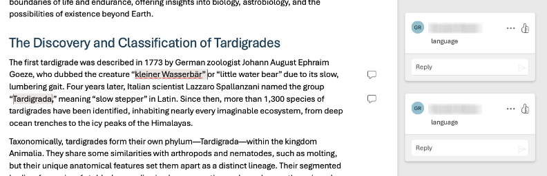

# Readme

Project hosting code and tools for the AI&S project (lead: Jenny Williams) studying writers and their use of AI tools.

## Requirements
- Python 3.x
- Visual Studio Code
- Jupyter (VS Code) extensions
- Poetry (dependency / virtual environment manager) https://python-poetry.org/

## Setting things up

Once you have installed poetry, you should install the python dependencies with:

```bash
poetry install
```

After, that you should in theory be ready to use and run the code in the notebook.


## Working with the notebook

Use the notebook after you have annotated a transcription document. To annotate a transcription, you will use MS Word, where you will add comments and highlights to the text. After you save the document, you can use the notebook to generate a markdown table that you can then import where you need it. Here is an example of what a comment looks like, where we apply the code `"language"` to a part of a document.



The sandbox.ipynb notebook helps extract codes from an annotated .docx transcript. Open it in VS Code (with Jupyter extension), configure any file paths, then run cells top to bottom.

## Questions
Send a yell to this guy [@gonzaloramos](https://github.com/gonzaloramos)